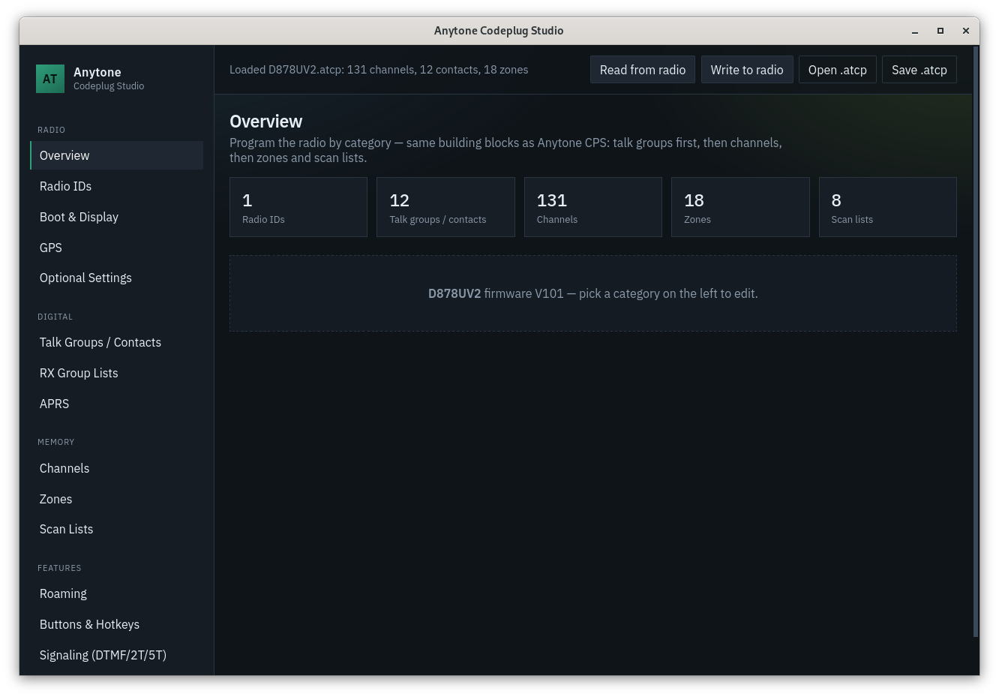
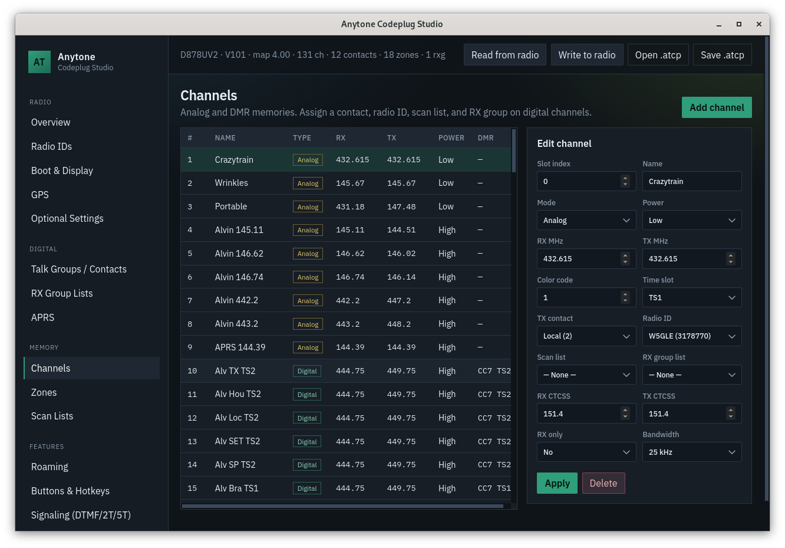
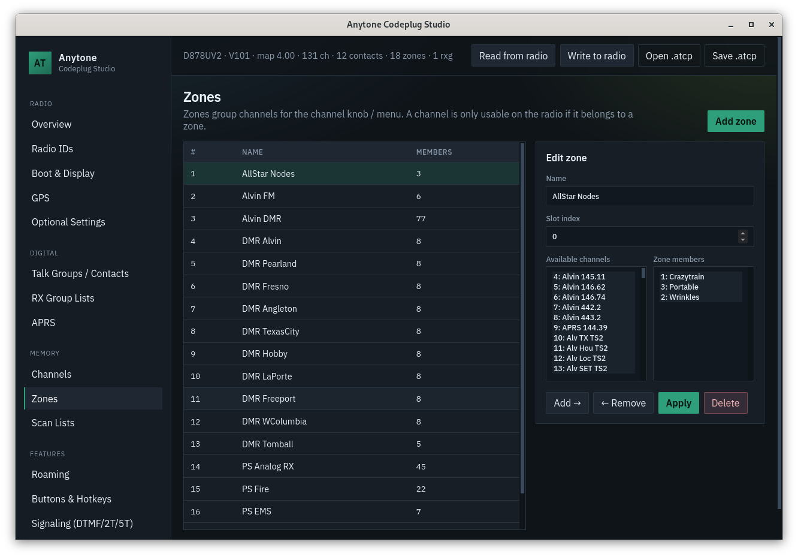

# anytone — Linux programmer for Anytone D878UV / D878UV II / D578UV

[](https://github.com/hardenedpenguin/AnyTone_CPS/actions/workflows/ci.yml)


[](https://hardenedpenguin.github.io/hardenedpenguin-apt/)


C toolchain plus a local **Codeplug Studio** UI for programming Anytone DMR
radios without Windows CPS.

<p align="center">
  <a href="docs/screenshots/overview.png"></a>
  <a href="docs/screenshots/channels.png"></a>
  <a href="docs/screenshots/zones.png"></a>
</p>

<p align="center"><em>Overview · Channels · Zones — click a thumbnail for full size</em></p>

## Quick start (UI)

```bash
make
./anytone ui          # desktop window (WebKitGTK, single process)
# or:
./anytone serve       # browser UI at http://127.0.0.1:8780/
```

Desktop build needs `libwebkit2gtk-4.1-dev` (Debian/Ubuntu). Without it, `ui`
falls back to telling you to use `serve`.

1. Connect the programming cable and power the radio on.
2. Click **Read from radio**.
3. Edit by category (channels, zones, APRS, GPS, …).
4. Click **Write to radio** (always keep a `.atcp` backup).

## Supported codeplug maps

Layouts come from the reverse-engineered catalog at
[dmr-tools/codeplugs](https://github.com/dmr-tools/codeplugs). The UI picks a
map from the radio’s Identify model (or the ATCP header).

| Radio | CPS / schema | Key |
|-------|----------------|-----|
| AT-D878UV II | **4.00** | `d878uv2_v4.00` |
| AT-D878UV | **4.00** | `d878uv_v4.00` |
| AT-D578UV / III | **1.21** | `d578uv_v1.21` |

Match **CPS version** to the map you use. Radio MCU strings like `V101` are not
the same as CPS `4.00` — use the CPS/firmware release notes for your model.

## Adding support for another radio

You need a **codeplug XML** that describes memory addresses and fields for that
model + CPS version. Those XML files are maintained upstream; this project
compiles them into JSON + a C memmap.

### 1. Get the XML

```bash
git clone https://github.com/dmr-tools/codeplugs.git
cd codeplugs
```

Browse the model folders (examples: `d878uv/`, `d878uv2/`, `d578uv/`, `d868uve/`,
`d890uv/`, …). Each folder has:

- `model.xml` — lists available firmwares and which codeplug file each uses
- `vX.YY.xml` — the actual codeplug layout for that CPS version

Pick the **latest** `<firmware … codeplug="v….xml"/>` entry that matches the
CPS you (or your users) run. Example from `d878uv/model.xml`:

```xml
<firmware name="4.00" released="2025-08-15" codeplug="v4.00.xml"/>
```

Copy both files into this repo:

```bash
cp codeplugs/d890uv/model.xml   /path/to/AnyTone/schema/d890uv_model.xml
cp codeplugs/d890uv/v1.02.xml   /path/to/AnyTone/schema/d890uv_v1.02.xml   # example
```

Naming convention here: `schema/<id>_v<cps>.xml` (dots kept in the version).

If your radio is missing from the catalog, it is not supported yet upstream —
contribute a layout there (or reverse-engineer with anytone-emu / CPS capture)
before wiring it here.

### 2. Compile XML → JSON + memmap

```bash
cd /path/to/AnyTone

python3 scripts/compile_schema.py schema/d890uv_v1.02.xml \
  -o web/schema/d890uv_v1.02.json \
  --memmap-c src/memmap_d890uv_v102.inc \
  --memmap-symbol D890UV_V102 \
  --model D890UV --firmware 1.02
```

- `--model` must match the string the radio returns on Identify (check with
  `./anytone info`), e.g. `D878UV`, `D878UV2`, `D578UV`.
- `--memmap-symbol` becomes `AT_REGIONS_<symbol>` in the generated `.inc`.
- Or run `make schema` after adding your compile lines to the `schema:` target
  in the `Makefile`.

### 3. Register the schema in the app

Edit `src/schema_catalog.c`:

1. `#include "memmap_d890uv_v102.inc"`
2. Add a `CATALOG[]` entry with `model_id`, `cps_firmware`, `json_name`, and
   the new `AT_REGIONS_*` pointers.
3. If the radio reports an alias (`D878UVII`, `D578UVIII`, …), extend
   `canonical_model()`.

Also add the new `.inc` to the `src/%.o` dependency line in the `Makefile`, then:

```bash
make
./anytone ui
```

Read from the radio (or import an ATCP from that model) and confirm the log
shows your schema, e.g. `Loaded schema … (D890UV CPS 1.02)`.

### 4. Keep maps in sync

When upstream publishes a newer CPS layout, copy the new `vX.YY.xml`, recompile,
bump the catalog entry, and retest dump/restore on hardware before trusting
writes.

## CLI

```bash
./anytone detect
./anytone info
./anytone dump -o backup.atcp
./anytone restore -i backup.atcp
./anytone serve -p 8780
./anytone ui
```

## Install (.deb)

From [Releases](https://github.com/hardenedpenguin/AnyTone_CPS/releases):

```bash
wget https://github.com/hardenedpenguin/AnyTone_CPS/releases/download/v0.1.1/anytone_0.1.1-1_amd64.deb
sudo apt install ./anytone_0.1.1-1_amd64.deb
```

Or build the package locally:

```bash
sudo apt install build-essential debhelper fakeroot pkg-config libwebkit2gtk-4.1-dev
make deb
sudo apt install ../anytone_*.deb
```

Tag a release after bumping `debian/changelog` to `X.Y.Z-1`, then
`git tag vX.Y.Z && git push origin vX.Y.Z` — CI builds the `.deb` and attaches
it to the GitHub Release.

## Build / install (from source)

```bash
make
sudo make install   # binary + web UI + udev rules + .desktop
```

Add your user to `dialout`, or use the bundled udev rules, then replug the cable.

## Safety

- Dump a backup before writing.
- Firmware / CPS mismatches can corrupt codeplugs; restore with matching CPS or
  factory-reset if needed.
- Does not flash `.CDD` firmware or the multi‑MB callsign database.

## License

GPL-3.0-or-later. Protocol and memory maps derived from community reverse
engineering ([dmr-tools/codeplugs](https://github.com/dmr-tools/codeplugs),
qdmr, anytone-flash-tools).
